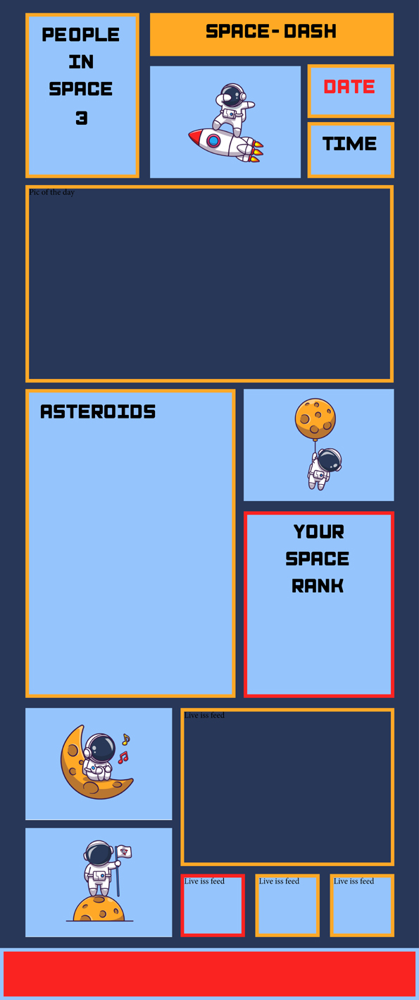
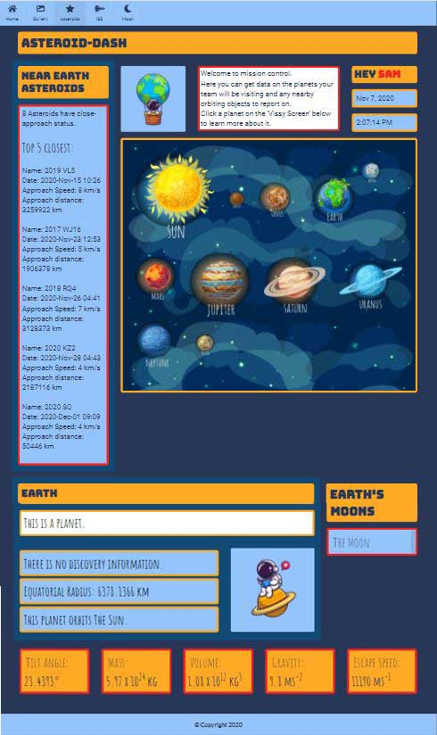

# SPACE-DASH

## Description
This project is designed to create an interactive learning dashboard with rich media.
To include images and video utilising NASA and other space related APIs.

#### Features:
* Picture of the day (Nasa)
* Nasa Image Gallery
* Find and track asteroids (Nasa)
* Return data on difffernet bodies in the solar system. 
* ISS live feed video 
* ISS live position tracking
* Moon Phases 

Target audience: Young learners passionate about astronomy. (primary aged)

The motivation for the project was to create a fun learning and interactive experience for children that have an interest in space. 

Requirments for the project included client side storage and at least two API. 

## Contents: 
1. Installation 
2. Proposed
2. Usage
3. Improvements
4. Updates
5. Credits
6. License

## Installation

The page loads everything needed to run straight from the github pages enviroment. [Access this page](https://hannahcloves.github.io/SPACE-DASH/).

The child can from the index.html page enter his/her name to add personalisation throughout the website. The name entered will apear on each subsequent page. 

#### APIs used:   
[Nasa](https://api.nasa.gov/)   
[ISS](https://api.wheretheiss.at/v1/satellites/25544)   
[Mapbox](https://api.mapbox.com/styles/v1/{id}/tiles/{z}/{x}/{y}?access_token={accessToken})    
[Moon Phases](https://api.farmsense.net/v1/moonphases/?d=135052658)     
[The Solar System OpenData](https://api.le-systeme-solaire.net/en/) 

Due to an insecure server usage we have had to stop using the ISS api and can no longer produce the information about the number of people in space or their details. We have changed this to feature the phases of the Moon. 

## Proposed

We are creating diffrent elements between the 4 members of our team, to bring together a commmon united learning resource for young learners.

We have chosen a common design and theme including a color scheme and wireframe / sketch of the chosen design. 

We need to endeavour to utilise and communicate as a team to make sure all seperate pages follow a common ground and look united at the presentation of the application. 

We have split off 4 sub pages so that we can all practise and utilise skills across all knowledge bases, helping each other where we become stuck or confused. We then come together to compile the main introduction page together to practise using platforms like github with multiple users. 

We have all had influence and aided across all pages despite there being a lead role for each page. 

#### Brand Image
Our initial design:

## Usage 

#### Ranger - Rank 
The number of visits the child makes to the site will have an effect on their space rank. The more often they visit or the more time spent learning on the site will increase their rankings. 

Currently this uses session storage to catch each page load and local storage to register each first load IF the session storage is empty on page load. This would have improved usage with further development.

If the child's session storage exceeds 100, it is reset and the local storage visit history is incremented, raising their rank. 

#### Picture of the Day
The picture of the day section is pulling once again from the NASA API. 

This is a specific part of the API where NASA choosed the picture of the day.

#### Asteroid Page

This page displays the close approach objects for all bodies selected within the Nasa API. For this API call we decided that the best input was to control what the children chose with button selectors rather than an input where spellings could be made incorrectly. 

For the Nasa API call the bodies had their own ID names that had to be reconfigured when the "jupiter" button is clicked and "jupiter is sent to the API, it is caught and "juptr" sent to the API. 

Similarly with the moon name returns, various accents had to be caught and replaced. 

The Solar system API is used to return the information about the individual bodies. Initially the child can choose a planet (the moon or sun) to return information, subsequently they can choose planetry moons associated with each planet. 

Each planet selection changes the close aproach data for asteroids approaching close to that planet.

#### Gallery Page
On load, this page gives a brief introduction of what you can do on this page. 

You can then see 4 sepearate boxes which hold different sets of images. To make it more user friendly, these have already been assigned.

Apollo Mission, The Moon, The Sun and The Galaxies. 

These are all pulling from the NASA Api. More specifcally the Image Library.

## Improvements

#### Asteroid Page
Additions that I would like to make to this page, include:
* Changing the date for the close approach asteroids to within a specified date. I think a good way to do this is to pick the initial date and a function would add or subtract a specified number of years (5). 

* Adding comet data to the page simalar to the Asteroids list. This code and API call are set up in the asteroids.js file. There are far less comets than there are asteroids and so a little time is needed to find a good date period to select from. 

* Adding major "need to know" asteroids and comets to the page like the planets have been displayed. For example Hally's comet. The comet data is all available in the Solar system Api and Nasa provides close aproach data. 

## Updates 

### Gallery Page
Add additional boxer the ISS and the Planets to tie back into the website.

Search function for a more "advance user"

#### Nasa Misson Design
Part of the Nasa Api selection is an API called Misson Design. 
This API provides access to the JPL/SSD small-body mission design suite. The following operation modes are available:

* Standard mode, which retrieves the pre-computed mission options and low-thrust delta-V estimates stored in the small-body database.

* Additional information is returned when operating the API in map mode. Apart from the information provided in query mode, the API will generate the complete dataset in order to plot time of flight vs departure date maps displaying different parameters. Mode M is an extension of mode Q.

I would really like to investigate this further and hopefully generate Mission senarios the children can role play with. 

#### Space Quiz

## Credits 

Freepik vector images:

We obtained correct permision for the graphics from catalyststuff and macrovector. The graphics cannot be used from our site or another without permission of the owner. 

 [Abstract vector created by macrovector - www.freepik.com](https://www.freepik.com/vectors/abstract)   
 [Cartoon vector created by catalyststuff - www.freepik.com](https://www.freepik.com/vectors/cartoon)   
 [Heart vector created by catalyststuff - www.freepik.com](https://www.freepik.com/vectors/heart)  
 [Logo vector created by catalyststuff - www.freepik.com](https://www.freepik.com/vectors/logo)   
 [Logo vector created by catalyststuff - www.freepik.com](https://www.freepik.com/vectors/logo)   
 [Heart vector created by catalyststuff - www.freepik.com](https://www.freepik.com/vectors/heart)   
 [Cartoon vector created by catalyststuff - www.freepik.com](https://www.freepik.com/vectors/cartoon)   
 [Cartoon vector created by catalyststuff - www.freepik.com](https://www.freepik.com/vectors/cartoon)  
 [Background vector created by catalyststuff - www.freepik.com](https://www.freepik.com/vectors/background)
 [Logo vector created by freepik - www.freepik.com](https://www.freepik.com/vectors/logo)
 [Logo vector created by vextok - www.freepik.com](https://www.freepik.com/vectors/logo)

 ## Badges 

 